Hacking a Quadcop for Adding a Computer Controllable Interface
==============================================================

This project is for interested makers showing how to equip a low-cost
quadcop with a computer interface.

Features
--------

* Recording control lever movements and push button activities that
  are manually applied on the quadcop's remote control.

* Bypassing the remote control and thus replaying recorded movements
  and push button activities as if they were applied on the remote
  control.

* Status display of the remote control
  - as LED indicators directly on the hardware interface and
  - per software on the connected computer's display.

Hardware
--------

### Architectural Overview

The 15$ Quadcopter (incl. remote control), with added black multi-core
cable with Sub-D plug as electrical signal interface:

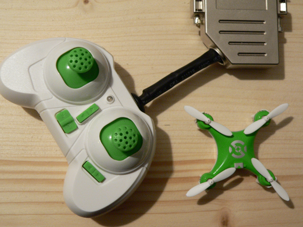

**Fig. 1: The 15$ Quadcop**

<br />

The Sub-D plug interfaces the signal adapter panel.  This panel cares
for analog signal treatment such as electrical level adjustment and
amplification.  It also features a couple of LEDs for visualizing the
current signal status (see image top left).

The signal adapter panel itself interfaces an Arduino Mega 2560 board.
The Arduino cares for real-time conversion of incoming analog signals
to digital signals and driving analog output signals from digital
signals, as well as short-time buffering of digital signal values.  It
also annotates digital signal values with timestamp data (see image
top right).

Finally, the Arduino interfaces a Raspberry Pi 3 (see bottom right),
running the “QuadCopApp” application on a Raspbian GNU/Linux 9
(stretch) operating system.

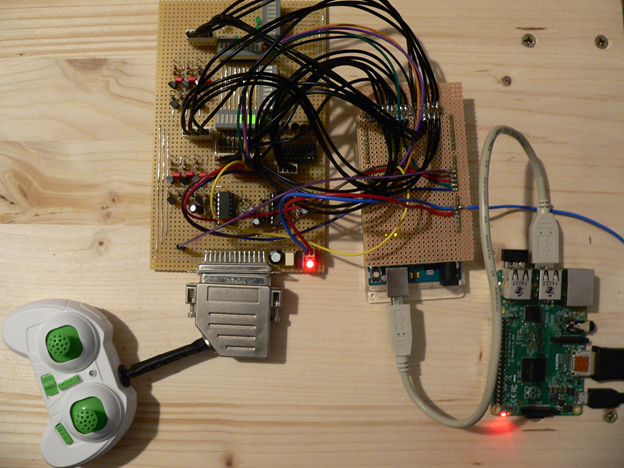

**Fig. 2: All building blocks at one glance**

<br />

### Remote Control

#### Pilot Stick Signal Tapping (1 out of 4)

Before surgery:

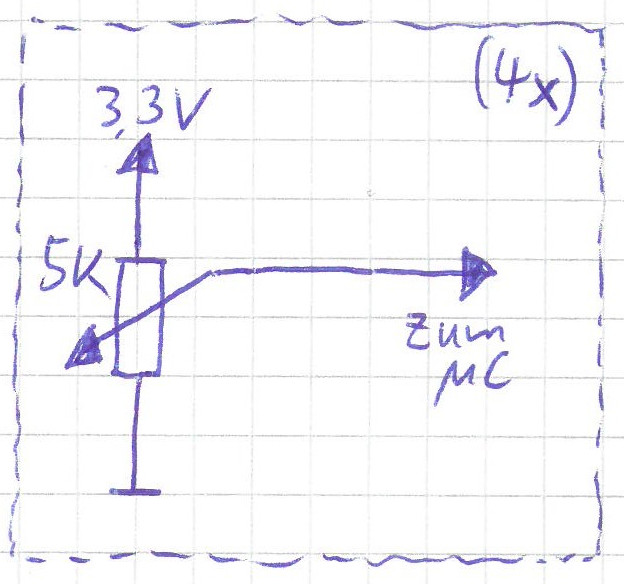

**Fig. 3: Pilot stick before surgery**

<br />

After surgery:

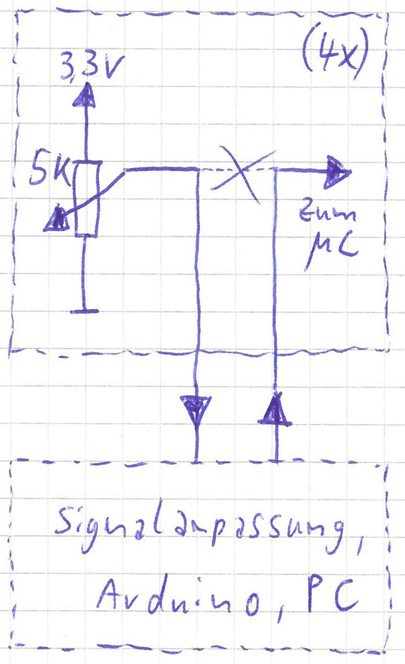

**Fig. 4: Pilot stick after surgery**

<br />

Signal tapping directly at the pilot sticks’ potentiometers:

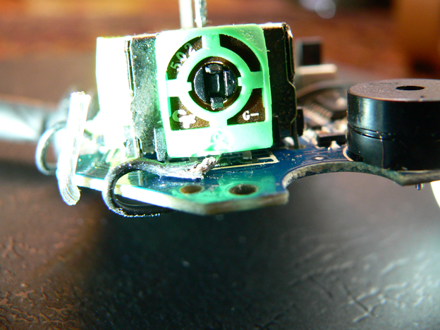

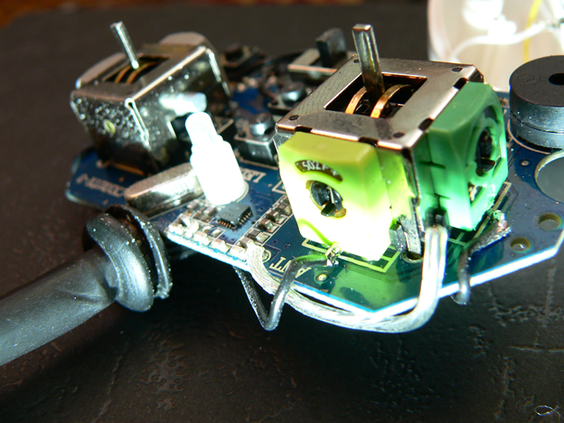

**Fig. 5: Potentiometer Signal Tapping**

<br />

#### Push Buttons Signal Tapping (1 out of 6), Original Design Approach

Before surgery:

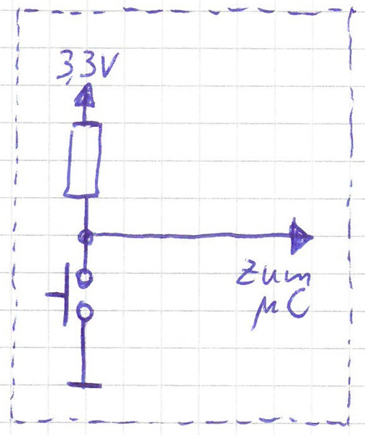

**Fig. 6 Button before Surgery**

<br />

After surgery:

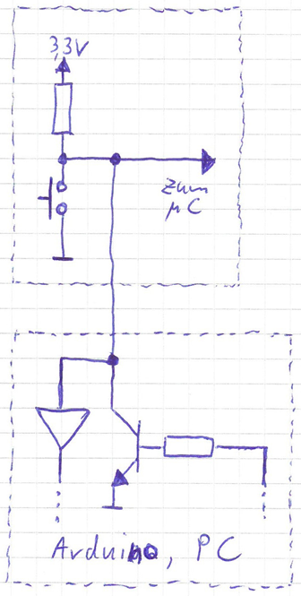

**Fig. 7 Button after Surgery**

<br />

Signal Tapping of Remote Control Push Buttons:

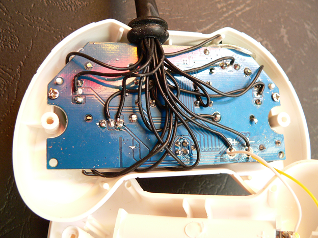

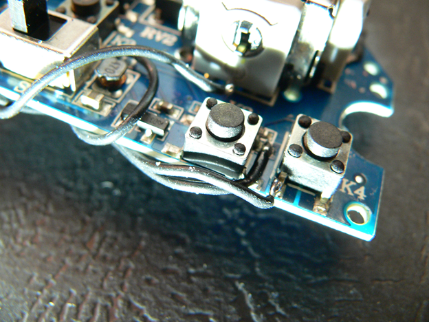

**Fig. 8 Button Signal Tapping**

<br />

#### Push Buttons Signal Tapping (1 out of 6), Final Design Approach

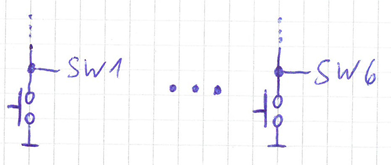

**Fig. 9 Button Signal Tapping Final Design Approach**

<br />

Measured resistance values between button taps:

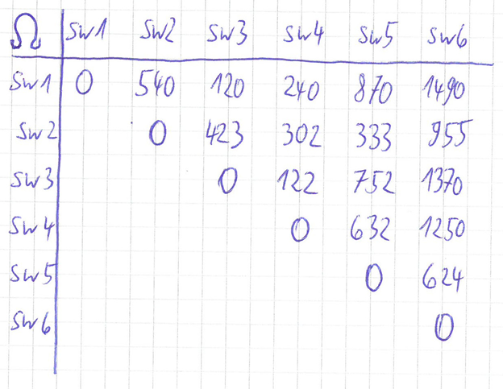

**Fig. 10 Measured Resistance Values**

<br />

Thereof derived reverse-engineered circuit design:

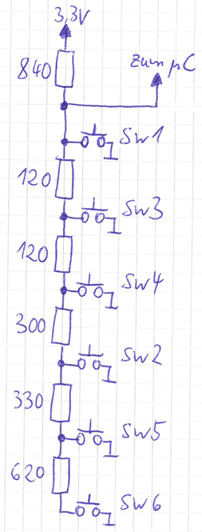

**Fig. 11 Derived Circuit Design**

<br />

#### Signal Routing

Signals (the black wires, added by me) are routed not parallel to the
transmission antenna (the thick silver wire at the right edge of the
printed board), but wired orthogonally to the antenna for minimizing
induction.  This way, we avoid effectively changing the size of the
antenna and thus the frequency and / or transmission quality:

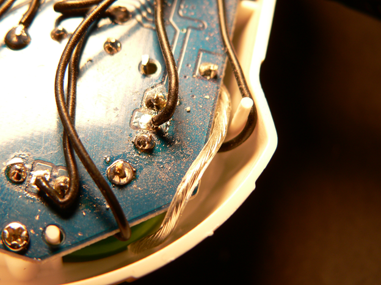

**Fig. 12 Signal Routing Around Antenna**

<br />

### Analog Signal Conversion Board

View onto analog signal conversion board with LED bargraphs that
display pilot stick position, as well as remote control push button
status LEDs:

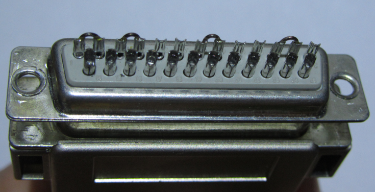

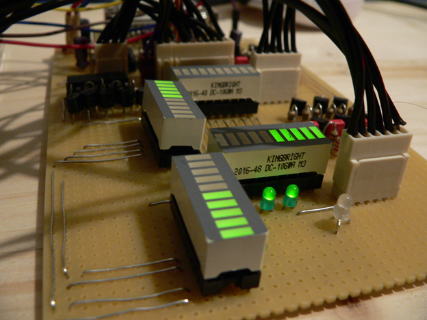

**Fig. 13 Analog Signal Conversion Board**

<br />

#### Analog Signal Conditioning, Pilot Stick Axes (1 out of 4)

* Impedance conversion via OpAmp (voltage follower)
* Level adjustment to 3,3V (QuadCop) ⬌ 5V (Arduino) via voltage
  divider 68kΩ / 33kΩ
* 490Hz PWM signal smoothing via low pass filter, with cut-off
  frequency near-by 10Hz

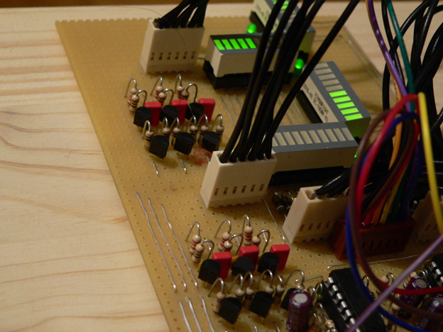

**Fig. 14 Analog Signal Conditioning**

<br />

#### Analog Signal Conditioning, Push Buttons

Common signal tap shared among all 6 push buttons:

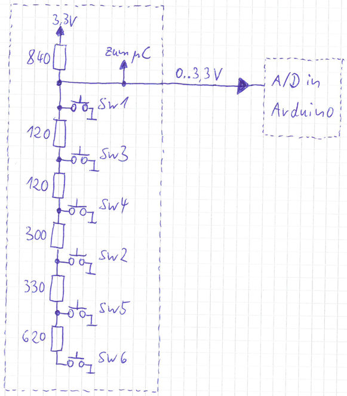

**Fig. 15 Common Push Buttons Tap**

<br />

Back signal (1 out of 6):

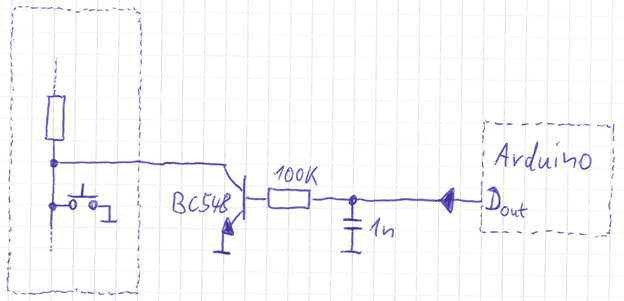

**Fig. 16 Push Button Back Signal**

<br />

#### LED Bargraph Display Matrix

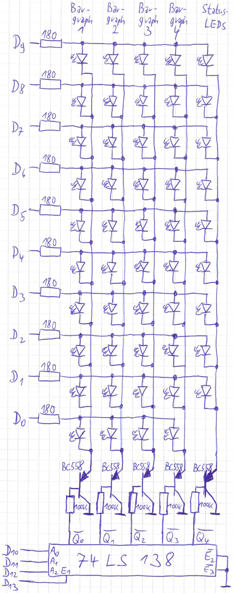

**Fig. 17 LED Bargraph Display Matrix**

<br />

### Arduino Board

An Arduino Mega 2560 Board hosts the software for realtime digital
flight control data recording, data serialization, data
deserialization, and analog flight control signal creation from
digital data.  Flight control data is transferred from and to the
Raspberry Pi board via serial data interface.

### Raspberry Pi Board

An Raspberry Pi 3 Board with Raspbian GNU/Linux 9 (stretch) operating
system hosts the Java Software “QuadCopApp” with Java Swing based GUI.
The software is used to persistently store and recall recorded flight
data, even at larger scale.  Not yet implemented but already
envisioned is also a flight data editor for either viewing and
modifying recorded flight data or even create flight data from
scratch.

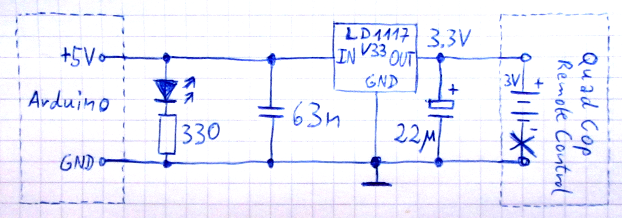

**Fig. 18 “QuadCopApp” Java Application**

<br />

Software
--------

Detailed documentation to be added.

### Arduino

#### Signal Layer: Signal Creation and Recording

##### Sampling

##### PWM

##### LED Display Driver

#### Digital Signal Treatment

#### Transport Layer: Interface Driver for Raspberry Pi

##### Serialization

##### Deserialization

##### Buffering

##### Synchronization

### Raspberry Pi

#### Compiling and Running the QuadCopApp Application

* Install a recent Raspbian version (such as Raspbian GNU/Linux 9
  (stretch)).

* Install the ```RXTXcomm.jar``` library.

  In order to run the `QuadCopApp` application, you need to have
  installed the _Java RXTX library_, typcially flying around as file
  `RXTXcomm.jar` e.g. in directory `/usr/share/java`.  If you have
  installed the _Arduino IDE_, you also may find it as part of the IDE
  installed files, e.g. as `/usr/share/arduino/lib/RXTXcomm.jar`.  If
  you can not find the file `RXTXcomm.jar` anywhere, try installing
  the library with the following command:

  ```$ sudo apt-get install librxtx-java```

* Go to your Raspberry Pi's home directory:

  ```$ cd```

* Clone all of the QuadCop software from github:

  ```$ git clone https://github.com/soundpaint/QuadCopHack.git```

* Go to the directory with the Java ```QuadCopApp``` application:

  ```$ cd QuadCopHack/rpi/src```

* Compile the Java ```QuadCopApp``` application:

  ```$ make all```

* Provided all hardware components are correctly connected, you are
  now ready to run the Java ```QuadCopyApp``` application:

  ```$ java -Djava.library.path=/usr/lib/jni -jar ../jar/QuadApp.jar```

* Make sure, that at startup of the ```QuadCopApp``` application, the
  arduino is up and connected via USB to the Raspberry Pi.  Otherwise,
  the ```QuadCopApp``` will show the error message “no serial port
  found”.

#### Transport Layer: Interface Driver for Arduino

##### Serialization

##### Deserialization

##### Buffering

##### Synchronization

#### Session Layer: Recording, Replaying and Persistent Storage

##### Recording

##### Replaying

##### Persistent Storage

#### Application Layer: The “QuadCopApp” Application

##### Session Control GUI

##### Graphical Flight Data Editor (not yet implemented)
