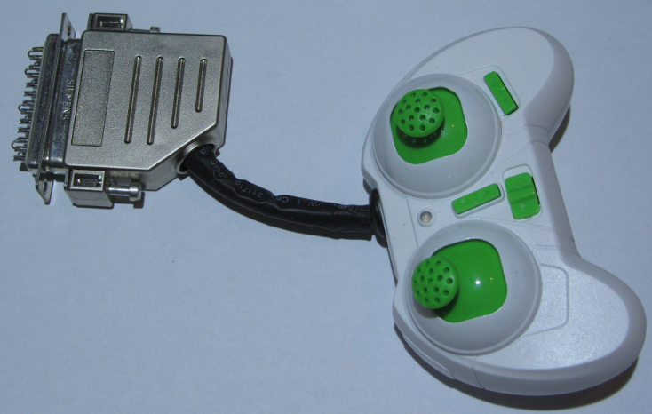
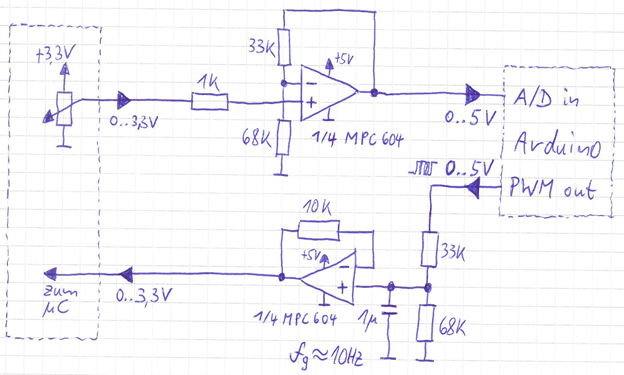

Hacking a Quadcop for Adding a Computer Controllable Interface
==============================================================

This project is for interested makers showing how to equip a low-cost
QuadCop with a computer interface.

Hardware
--------

### Architectural Overview

The 15$ Quadcopter (incl. remote control), with added black multi-core
cable with Sub-D plug as electrical signal interface:

Fig. 1: The 15$ Quadcop

The Sub-D plug interfaces the signal adapter panel.  This panel cares
for analog signal treatment such as electrical level adjustment and
amplification.  It also features a couple of LEDs for visualizing the
current signal status (see image top left).

The signal adapter panel itself interfaces an Arduino Mega 2560 board.
The Arduino cares for real-time conversion of incoming analog signals
to digital signals and driving analog output signals from digital
signals, as well as short-time buffering of digital signal values.  It
also annotates digital signal values with timestamp data (see image
top right).

Finally, the Arduino interfaces a Raspberry Pi 3 (see bottom right),
running the “Quad App” application on a Raspbian Jessie Linux
environment.

Fig. 2: All building blocks at one glance

### Remote Control

#### Pilot Stick Signal Tapping (1 out of 4)

Before surgery:

Fig. 3: Pilot stick before surgery

After surgery:

Fig. 4: Pilot stick after surgery

Signal tapping directly at the pilot sticks’ potentiometers:

Fig. 5: Potentiometer Signal Tapping

#### Push Buttons Signal Tapping (1 out of 6), Original Design Approach

Before surgery:

Fig. 6 Button before Surgery

After surgery:

Fig. 7 Button after Surgery

Signal Tapping of Remote Control Push Buttons:

Fig. 8 Button Signal Tapping

#### Push Buttons Signal Tapping (1 out of 6), Final Design Approach

Fig. 9 Button Signal Tapping Final Design Approach

Measured resistance values between button taps:

Fig. 10 Measured Resistance Values

Thereof derived reverse-engineered circuit design:

Fig. 11 Derived Circuit Design

#### Signal Routing

Signals (black wires) are routed not parallel to transmission antenna,
but wired orthogonally to the antenna for minimizing induction.  This
way, we avoid effectively changing the size of the antenna and thus
the frequency and / or transmission quality:

Fig. 12 Signal Routing Around Antenna

### Analog Signal Conversion Board

View onto analog signal conversion board with LED bargraphs that
display pilot stick position, as well as remote control push button
status LEDs:

Fig. 13 Analog Signal Conversion Board

#### Analog Signal Conditioning, Pilot Stick Axes (1 out of 4)

* Impedance conversion via OpAmp (voltage follower)
* Level adjustment to 3,3V (QuadCop) ⬌ 5V (Arduino) via voltage divider 68kΩ / 33kΩ
* 490Hz PWM signal smoothing via low pass filter, with cut-off frequency near-by 10Hz

Fig. 14 Analog Signal Conditioning

#### Analog Signal Conditioning, Push Buttons

Common signal tap shared among all 6 push buttons:

Fig. 15 Common Push Buttons Tap

Back signal (1 out of 6):

Fig. 16 Push Button Back Signal

#### LED Bargraph Display Matrix

Fig. 17 LED Bargraph Display Matrix

### Arduino Board

The Arduino Board hosts the software for realtime digital flight
control data recording, data serialization, data deserialization, and
analog flight control signal creation from digital data.  Flight
control data is transferred from and to the Raspberry Pi board via
serial data interface.

### Raspberry Pi Board

The Raspberry Pi Board hosts the Java Software „Quad App” with Java
Swing based GUI.  The software is used to persistently store and
recall recorded flight data, even at larger scale.  Not yet
implemented but already envisioned is also a flight data editor for
either viewing and modifying recorded flight data or even create
flight data from scratch.

Fig. 18 „Quad App” Java Application

Software
--------

Detailed documentation to be added.

### Arduino

#### Signal Layer: Signal Creation and Recording

##### Sampling

##### PWM

##### LED Display Driver

#### Digital Signal Treatment

#### Transport Layer: Interface Driver for Raspberry Pi

##### Serialization

##### Deserialization

##### Buffering

##### Synchronization

### Raspberry Pi

#### Transport Layer: Interface Driver for Arduino

##### Serialization

##### Deserialization

##### Buffering

##### Synchronization

#### Session Layer: Recording, Replaying and Persistent Storage

##### Recording

##### Replaying

##### Persistent Storage

#### Application Layer: The “Quad App” Application

##### Session Control GUI

##### Graphical Flight Data Editor (not yet implemented)
